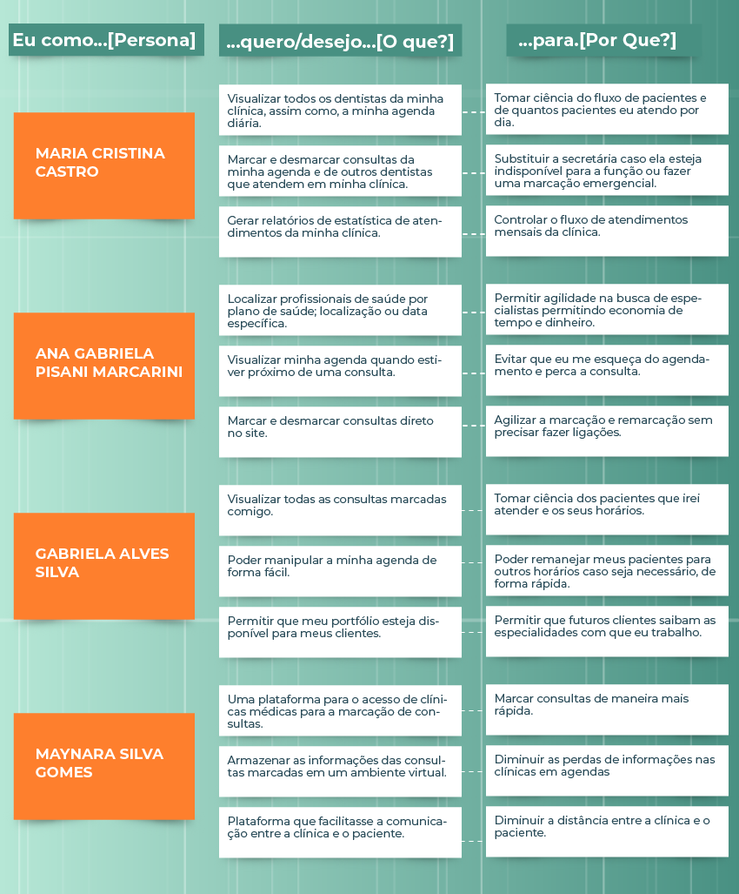

# Especificação do Projeto

A definição exata do problema e os pontos mais relevantes a serem tratados neste projeto foi consolidada com a participação de usuários e possíveis clientes, por meio de entrevistas. Os detalhes levantados nesse processo foram consolidados na forma de personas e histórias de usuários.

## Personas

As personas levantadas durante o processo de entendimento do problema são baseadas em entrevistas com pessoas reais e apresentadas nas Figuras que se seguem.

## Histórias de Usuários

A partir da compreensão do dia a dia das personas identificadas para o projeto, foram registradas as seguintes histórias de usuários.

## Requisitos do Projeto

O escopo funcional do projeto é definido por meio dos requisitos funcionais, que descrevem as possibilidades de interação dos usuários, bem como os requisitos não funcionais, que descrevem os aspectos que o sistema deverá apresentar de maneira geral. Estes requisitos são apresentados a seguir.

### Requisitos Funcionais

A tabela a seguir apresenta os requisitos do projeto, identificando a prioridade em que os mesmos devem ser entregues.

|ID    | Descrição do Requisito  | Prioridade |
|------|-----------------------------------------|----|
|RF-01| O sistema deve oferecer um formulário de cadastro com campos exclusivos para clínicas e médicos.| ALTA | 
|RF-02| O sistema deve oferecer um formulário de cadastro para pacientes.   | ALTA |
|RF-03| O sistema deve oferecer um formulário de login direcionado a clínicas, médicos e pacientes.   | ALTA |
|RF-04| O sistema deve oferecer um dashboard para gerenciamento de médicos de uma clínica, bem como listar os próximos pacientes na agenda.   | ALTA |
|RF-05| O sistema deve oferecer uma landing page voltada para pacientes com slides informativos.   | ALTA |
|RF-06| A landing page terá um campo de busca com listagem de especialidades, data de consulta e localização.   | ALTA |
|RF-07| O sistema deve oferecer um perfil público do médico ao clicar em seu card na listagem, que mostre suas informações e agenda.   | ALTA |
|RF-08| O sistema deve oferecer um fluxo de agendamento de consultas por parte de pacientes.   | ALTA |
|RF-09| O sistema deve oferecer um fluxo de agendamento de consultas.   | ALTA |
|RF-10| O sistema deve oferecer notificações de status (pendente, aprovado, recusado) de agendamento para clínicas e pacientes.   | MÉDIA |
|RF-11| O sistema deve oferecer filtros de busca de cobertura de plano, proximidade e disponibilidade de datas.   | MÉDIA |
|RF-12| O sistema deve oferecer a visualização de histórico de consultas agendadas pelo paciente   | MÉDIA |
|RF-13| O sistema deve oferecer ferramentas de acessibilidade: alterar esquema de cores para daltonismo.   | MÉDIA |
|RF-14| O sistema deve oferecer opção de confirmação de presença ou cancelamento de consulta agendada pelo paciente.   | MÉDIA |
|RF-15| O sistema deve oferecer uma landing page voltada para clínicas, com preços e planos da plataforma.   | BAIXA |
|RF-16| O sistema deve oferecer formulário de recuperação de senha.   | BAIXA |
|RF-17| O sistema deve oferecer formulário de alteração de dados cadastrais e perfil.   | BAIXA |
|RF-18| O sistema deve ter uma área de suporte ao usuário e perguntas frequentes sobre a utilização plataforma.   | BAIXA |
|RF-19| O sistema deve oferecer uma área de tutoriais de utilização por parte de clínicas ou pacientes.   | BAIXA |
|RF-20| O sistema deve oferecer gerenciamento de assinatura de planos para clínicas médicas.   | BAIXA |
|RF-21| O sistema deve oferecer checkout de planos para clínicas médicas.   | BAIXA |
|RF-22| O sistema deve oferecer uma página contendo termos de utilização da plataforma.   | BAIXA |
|RF-23| O sistema deve oferecer uma página contendo a política de privacidade da plataforma.   | BAIXA |

### Requisitos não Funcionais

|ID     | Descrição do Requisito  |Prioridade |
|-------|-------------------------|----|
|RNF-01| O website deverá atender os requisitos de compatibilidades com o Google Chrome. | ALTA | 
|RNF-02| Uso de Design responsivo nas telas do padrão Mobile S (320px) do Google Chrome |  ALTA | 
|RNF-03| O site website deverá oferecer proteção de navegação (utilizar o certificado SSL). |  ALTA | 
|RNF-04| Escolher um serviço de hospedagem de boa qualidade para otimizar e aumentar a performance do website.|  ALTA | 
|RNF-05| Tempo limite para expiração de sessão ao agendar uma consulta, que deve ser reservada por 15 minutos para que outros usuários não marquem o mesmo horário.|  MÉDIA | 
|RNF-06| Os horários disponíveis para agendamento são de 2 horas a partir da próxima hora comercial. Exemplo: usuário que marca consulta às 23h do dia anterior só poderá escolher horários a partir das 9h do dia seguinte (se a clínica começar a funcionar a partir das 7h).|  MÉDIA | 
|RNF-07| As clínicas têm um prazo de 1 hora para aceitar uma solicitação de agendamento online, dentro de seu horário comercial.|  MÉDIA | 
|RNF-08| O website deve utilizar aceleradores como CDNs e sprites de imagens para otimizar o carregamento em dispositivos móveis e em conexões instáveis de internet.|  MÉDIA | 

## Restrições

O projeto está restrito pelos itens apresentados na tabela a seguir.

|ID| Restrição                                             |
|--|-------------------------------------------------------|
|RE-01| O projeto deverá ser entregue no final do semestre letivo, não podendo extrapolar a data de 06/12/2021 |
|RE-02| A plataforma deve se restringir às tecnologias da Web no Frontend (HTML, CSS e JS)        |
|RE-03| A equipe não pode subcontratar o desenvolvimento do trabalho |

