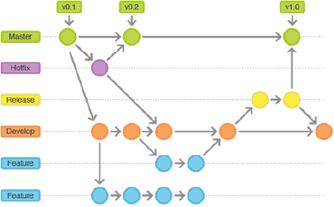
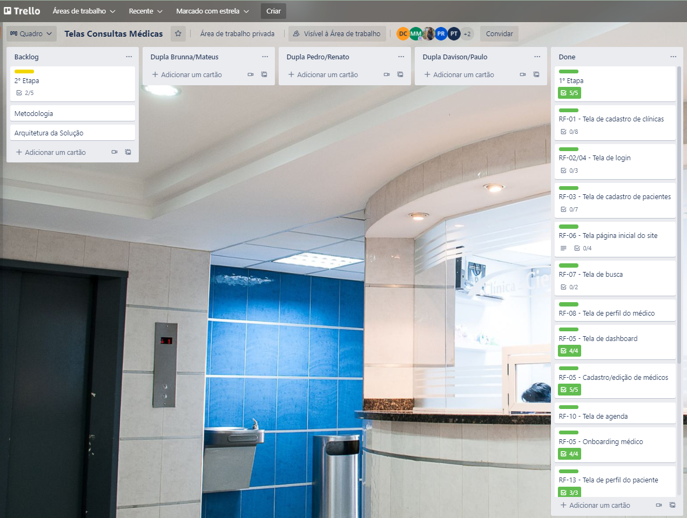
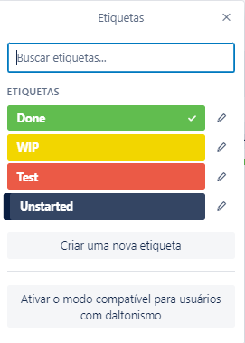

# Metodologia

Pré-requisitos: <a href="2-Especificação do Projeto.md"> Documentação de Especificação</a>

Serão abordados nesse tópico as ferramentas utilizadas para a construção da plataforma e, assim como, utilizadas para as manutenções futuras dos códigos e artefatos gerados na elaboração do projeto.

## Relação de Ambientes de Trabalho

Os artefatos do projeto são desenvolvidos a partir de diversas plataformas e a relação dos ambientes com seu respectivo propósito é apresentada na tabela que se segue. 

|Ambiente   | Descrição do Requisito  | Prioridade |
|-----------|----------------------------------|------|
|Repositório de código fonte e versionamento| GitHub | [Link](https://github.com/orgs/ICEI-PUC-Minas-PMV-ADS/teams/ads_2021_02_e1_grupo_3_consultas) GitHub | 
|Documentos do projeto | Microsoft Teams | [Link](https://teams.microsoft.com/_#/docx/viewer/teams/https:~2F~2Fsgapucminasbr.sharepoint.com~2Fsites~2Fteam_sga_865_2021_2_5954107-Grupo3-19h30-19h45~2FDocumentos%20Compartilhados~2FGrupo%203%20-%2019h30-19h45~2FTarefa%202%20-%20Grupo%203.docx?threadId=19:f600f95aca8e4d00a3ae9d9bc5f7e7fa@thread.tacv2&baseUrl=https:~2F~2Fsgapucminasbr.sharepoint.com~2Fsites~2Fteam_sga_865_2021_2_5954107-Grupo3-19h30-19h45&fileId=bda4b774-8429-41dd-8c0d-1fe4780a8c63&ctx=files&rootContext=items_view&viewerAction=view) Teams |
|Projeto de interface e Wireframes | Figma | [Link](https://www.figma.com/file/nc5yh413tN7drT96NghJnZ/Site?node-id=0%3A1) Figma |
|Gerenciamento do projeto|  Trello | [Link](https://trello.com/b/zpusdWXw/telas-consultas-m%C3%A9dicas) Trello |

## Gestão do Código Fonte

Para gestão do código fonte do software desenvolvido pela equipe, o grupo utiliza um processo baseado no Git Flow abordado por Vietro (2015), mostrado na Figura a seguir. Desta forma, todas as manutenções no código são realizadas em branches separados, identificados como Hotfix, Release, Develop e Feature. Uma explicação rápida sobre este processo é apresentada no vídeo "The gitflow workflow - in less than 5 mins".

*Figura 1 - Fluxo de controle do código fonte no repositório git*

## Gerenciamento de Projeto

A equipe utiliza metodologias ágeis, tendo escolhido o Scrum como base para definição do processo de desenvolvimento.

### Divisão de Papéis

A equipe está organizada da seguinte maneira:
- **Scrum Master:** Mateus Cunha Melo
- **Product Owner:** Davison Cavalcante Barros
- **Equipe de Desenvolvimento:**
    - Brunna Alves Lage Silva
    - Davison Cavalcante Barros
    - Mateus Cunha Melo
    - Pedro Thiago Rodrigues Santos
- **Equipe de Design**
    - Brunna Alves Lage Silva
    - Pedro Thiago Rodrigues Santos

### Processo

Para organização e distribuição das tarefas do projeto, a equipe está utilizando o Trello estruturado com as seguintes listas: 

Backlog: recebe as tarefas a serem trabalhadas e representa o Product Backlog. Todas as atividades identificadas no decorrer do projeto também devem ser incorporadas a esta lista;
Duplas: Recebe as tarefas do backlog para serem desenvolvidas pela equipe.
Done: nesta lista são colocadas as tarefas que passaram pelos testes e controle de qualidade e estão prontos para ser entregues ao usuário. Não há mais edições ou revisões necessárias, ele está agendado e pronto para a ação.

O quadro kanban do grupo no Trello está disponível através da URL https://trello.com/b/zpusdWXw/telas-consultas-m%C3%A9dicas e é apresentado, no estado atual, na Figura 2. A definição desta estrutura se baseou na proposta feita por Littlefield (2016).

*Figura 2 - Tela do Kanban utilizada pelo grupo*

A tarefas são, ainda, etiquetadas em função da natureza da atividade e seguem o seguinte esquema de cores/categorias:
- **Done**: Tarefa realizada;
- **WIP** (Work in Progress): Tarefa em realização;
- **Test**: Tarefa em teste para validação do usuário;
- **Unstarted**: Não iniciado.

*Figura 3 - Etiquetas do Trello*

