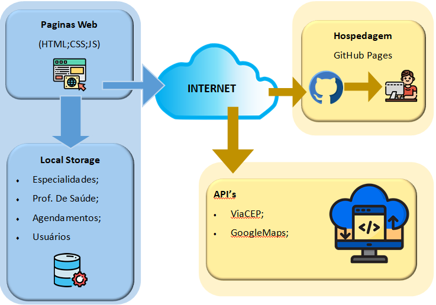

# Arquitetura da Solução

Pré-requisitos: <a href="3-Projeto de Interface.md"> Projeto de Interface</a>

Esta seção apresenta os detalhes técnicos da solução criada pela equipe, tratando dos componentes que fazem parte da solução e do ambiente de hospedagem da solução.

## Diagrama de componentes

Os componentes que fazem parte da solução são apresentados na Figura que se segue.

*Figura 36 - Arquitetura da Solução*

A solução implementada conta com os seguintes módulos:
- **Navegador** - Interface básica do sistema 
  -	**Páginas Web** - Conjunto de arquivos HTML, CSS, JavaScript e imagens que implementam as funcionalidades do sistema.
  - **Local Storage** – armazenamento de pares de chaves e valores que persistem na memória do navegador.
    - **ESPECIALIDADES**- lista de especialidades médicas (JSON array)
    -	**PROFISSIONAIS DE SAÚDE**- lista de profissionais de saúde relacionados a uma especialidade médica (JSON array)
    -	**AGENDAMENTOS**- lista de agendamentos feitos por um paciente ou lista de pedidos de agendamentos para um profissional (JSON array)
    -	**USUÁRIO** - metadados de usuário, que persistem entre as telas (JSON)
- **ViaCEP API** – api para preenchimento automático de endereços a partir do cep
-	**Hospedagem** – servidor onde serão armazenados os arquivos do site e mostrados a cada requisição de página.

## Hospedagem

O site será hospedado na plataforma do GitHub Pages, sendo mantido no ambiente via URL:
https://username.github.io
 
A publicação do site no GitHub pages é feita por meio de uma sincronização da branch main do repositório com o serviço.
 
https://github.com/ICEI-PUC-Minas-PMV-ADS/pmv-ads-2021-2-e1-proj-web-t7-ads_2021_02_e1_grupo_3_consultas-1

