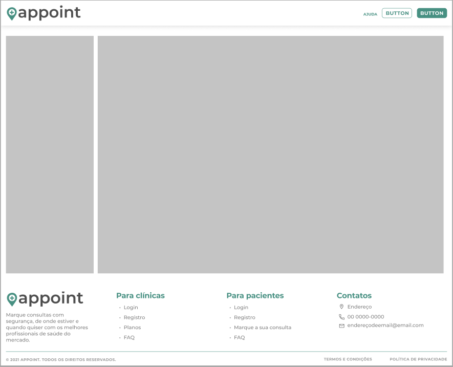

# Template padrão do site

As telas do site, apresentadas no item 4, apresentam um layout baseado na Figura 37 abaixo:

*Figura 37 – Template do site*

O layout é composto pelos itens:

1.	**Barra de Navegação:** Barra da parte superior que irá abrigar as funcionalidades de usuário, como: botão de login e demais links de páginas. Quando o login é efetuado, a barra de navegação é alterada: o botão de login é substituído pelos botões de notificações e informações da conta.

2.	**Conteúdo:** a parte central do template irá se modificar a (a partir da navegação do usuário no menu lateral. A noção de uma barra lateral passa a ser mais presente nas páginas internas do usuário tipo clínica/médico, sendo o conteúdo mais livre nas demais páginas.

3.	**Barra de Rodapé:** Barra final do site onde se encontram um resumo de navegação, assim como informações de contato da plataforma.

A responsividade da plataforma será realizada de acordo com o padrão de breakpoints do Bootstrap, atentando-se para: sm (celulares a partir do modo paisagem), md (tablets) e lg (desktops).

## Landing Page

Ponto de entrada da plataforma (index), em que é possível acessar um formulário rápido de busca e demais links do menu e rodapé.

## Modal de Login

Janela modal que ocupa parte da tela em tablets e desktops, mas que tem aparência de tela inteira em celulares. Há um formulário para realizar login na plataforma, bem como demais links para recuperação de senha, cadastro e login por redes sociais.

## Cadastro de pacientes

Tela em que o usuário do tipo paciente pode preencher um formulário de cadastro na plataforma. Ao lado esquerdo, encontra-se um vídeo informativo sobre o site. Este vídeo está oculto em celulares por padrão.

## Cadastro de clínicas

Tela similar à de cadastro de pacientes, mas com o formulário visando o cadastro de clínicas, com alguns campos específicos e um vídeo informativo sobre o lado de gestão da plataforma.

