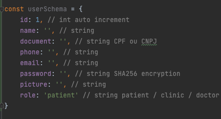

# Funcionalidades do Sistema (Telas)

Pré-requisitos: <a href="2-Especificação do Projeto.md"> Especificação do Projeto</a>, <a href="3-Projeto de Interface.md"> Projeto de Interface</a>, <a href="4-Metodologia.md"> Metodologia</a>, <a href="3-Projeto de Interface.md"> Projeto de Interface</a>, <a href="5-Arquitetura da Solução.md"> Arquitetura da Solução</a>

Com o intuito de associar os requisitos funcionais apresentados anteriormente às telas desenvolvidas, a presente seção traz uma lista de requisitos atendidos e artefatos utilizados, bem como suas respectivas instruções de acesso.

## Tela inicial (RF-05 e RF-06)
Tela central do site que abrange as visualizações iniciais tais como: botão de log-in do usuário e cartões de informação ao usuário conforme a Figura 38 abaixo.

*Figura 38 – Landing page*

Os campos de busca das especialidades, por lugar e por data estão implementadas no front-end da página e suas funcionalidades serão criadas nas próximas etapas.

## Tela cadastro de usuários (RF-01, RF-02)
O sistema terá cadastros separados para clínicas e pacientes, tendo campos semelhantes entre os diferentes usuários como: Nome, Email, Celular, Senha e Confirmar a sua senha. Sendo para o usuário paciente a utilização de CPF e para a clínica a utilização de CNPJ.

*Figura 39 – Tela de cadastro de paciente*

*Figura 40 – Tela de cadastro de clínica*

## Tela Log-in de usuários (RF-03)
A tela poderá ser acessada através do botão LOG-IN na página inicial, nesta tela será solicitado a inserção das informações do usuário, que podem ser email e senha ou métodos de acesso via Facebook ou Google (apenas para usuários do tipo pacientes), e após a autenticação dos dados o usuário é direcionado para o ambiente interno de navegação da plataforma. 

*Figura 41 – Tela de Login*

*Figura 42 – Estrutura de dados da tela de login*

